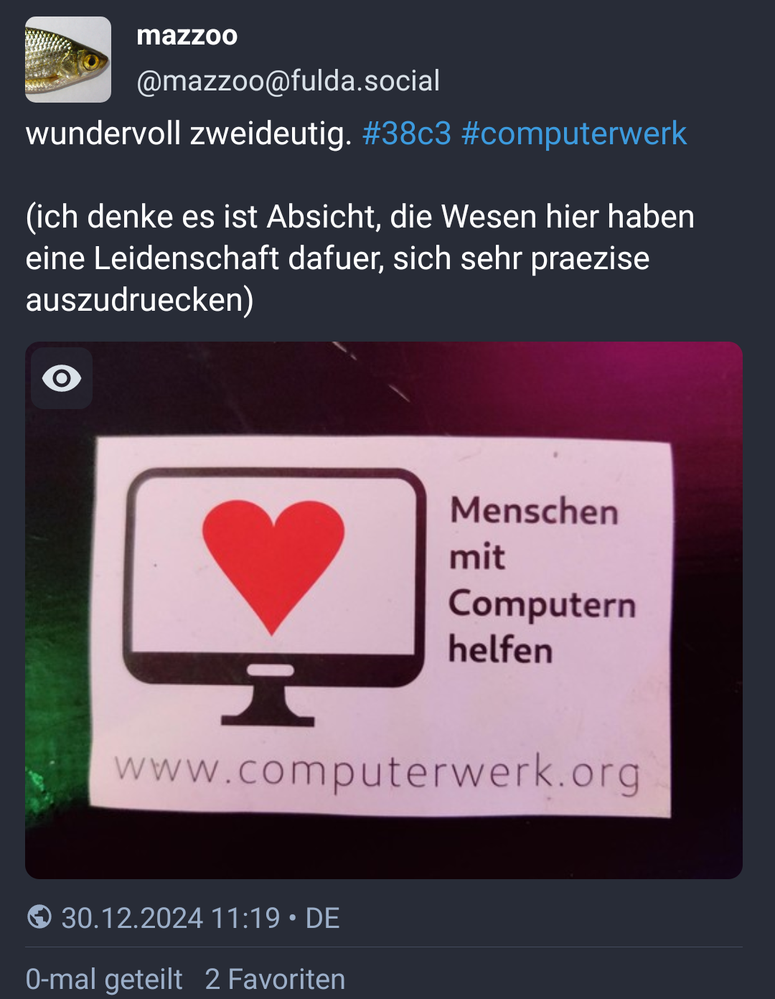

## Folien online

[ses-ch.github.io/Schnupperkurs](https://ses-ch.github.io/Schnupperkurs/)  
![](data:image/gif;base64,R0lGODlhhACEAJEAAAAAAP///wAAAAAAACH5BAEAAAIALAAAAACEAIQAAAL/jI+py+0Po5y02ouz3rz7D4biSJbmiabqyrbuC8chQNf2jedIDjD2XgPyhr0D8aibIJdBY1Lxc9KEzKahuqRgkdQo1BrwhrdTKfkZOQ+7YKrbjGWryxKxFsxd8OTFL338dxf4YKeEd+SDtqd3OFjXRgj5+Jfnd8OXSCmZtpnZVyFWmbB4hfZW6siZ6skX2slIJPjpqhlrJtva+Akhyqt7Crh2a1grjLobaTs5+wun+GqZWyxLqso87YwD7FtcTYt8LG0czJp9ObwsDlwYbi7KTu7enC6P3R5dPw7/7Q09qtvP3r9uVbahCxYQXAN+z1ZtqIbp4Dt/6xAdBAHRXEVl//HoHUtIIuPHeQgbKiw3UtvFDyJLCpzoEJ8FeNxOwhpn0KM1DDST2bTUsqcDoQN/LqR4k5qplTpr8kQq01pQqEWVzrmGdWNWiQCvGhUXh+tLkt/AFiTmdazarfc6upxjFa5Ytm7Lzk0rI2WWpPmI5s2gBuXbln85BOarl3BhDYejhpXBkKBKoGQtts1Zd+nQrpLPUV4LEnFVjWgjJt4U+rRAzJG/3uXsuahd1XRZw8blc5/lt57SKr7ss6ZujlN94xTtNDfq3cWNax7d9OZwfc+dH48q3N9jt5gFG36ePeZgk96DswSvXPz26bg9/D46Gf5e4PTlY0Q/c7c65KRpt/9Ozph++ZSnl1mdAQiYgLQRyFtft5kXIEf7YdffePG955doCW3XG37cpeeaThuetZmE/JUY23cHOhhfhy2eKF+GIprEoXQeythghClqyByNZ7ioUC8gIghTbHjZmIqQKBLV2n8sXpejbB6aZt+AFR75WZAKxkgSlSOq1yWSWL3n5XIX+gjmamJOKFWYBV55o5tSdoZjanOO+SCK3cFp4jJKZpYkbHWaqaV44UE5G3QWhvhhfTgC2ZxtdFLFHoxxRcoUoFAyWGl+hlp6AZNblvkphdHpeKioZ5aqaHsdqLopn4zuqed5acb6Zn1PMXFpnjvx2GeCvKL1JaOdLnrfsH7/omksoWyqOF+bq+5Yq2OjQtiqlY72+GKWie5aaLh2sokht7PCON242kYJqZyuSkpdoMTFOS+ryRpVbLra7Wuvrfgyq++tCLIAa5OEwjrwCgULejC///a75I/obmndn+A2lu2CYlZMVaokZozsxhyfGzEZnFI8MpkvHOtxsAZS2wLLIFr85KMjyFxytO26rLCzxH68M653Yoxzo5omqu6yV8F78optJS2tXNvKGy6peKqptNRGF+3k0+SF2vFrS2dKK7sPhe21cWUvDHGVnl6tNcJD+gvuy0UmnOW95Pqc69ANK2u0q3cDC/OfRKOt6ODWdhuyt+ZCuzfVVD5bs7ulqq3bdeAVRo4opQyDZnnfnGM6Y71wr12duaT/qnHaRjoc8OvBDjop6LU/rHOm32KreJQ0+8d34p7frpXBtxoePO1wIw0w7ChLTjao1XJpO13H7n4q69Rb//XU3Ldts66yWs30XHWDfXxl05bv+sVeTb6m2Fto5f7Yosfv+uFYR60/zORXvr7o5ax/bPte3EK3mAQqcIEMbKADHwjBCEpwghSsoAUviMEMIqAAADs=)

Quellcode: [github.com/SES-CH/Schnupperkurs](https://github.com/SES-CH/Schnupperkurs)

## Basierend auf

«39c3 Esperanto course»

von

Eva Fitzelová 🇸🇰 · Johannes Mueller 🇩🇪

[github.com/c3esperanto/kurseto](https://github.com/c3esperanto/kurseto)

# Einleitung

## Eckpunkte
:::::::::::::: {.columns}
::: {.column width="60%"}
* veröffentlicht 1887 von L. L. Zamenhof, Polen (damals russisch besetzt)
* Anzahl der Nutzenden:
  * $10^3$ Muttersprachler:innen
  * $10^5$ fließende regelmäßige Sprecher:innen
  * $10^6$ "mal angefangen zu lernen"
* weltweit gesprochen, leichter Fokus auf Europa
* Language-Code: `eo`, `epo`
  * in viel Software unterstützt: WordPress, Hunspell, LibreOffice, Firefox, KDE, …
:::
::: {.column width="40%"}
{.sideimage}
:::
::::::::::::::

## Spracheigenschaften

* phonetisches Alphabet
* Herkunft der Wortstämme
  * ⅔ romanisch
  * ⅓ germanisch
  * vereinzelt slawisch, altgriechisch, hebräisch
* simple Grammatik
* mächtiges Wort·bau·system

## Beispieltext

Hodiaŭ mi donas kurseton pri Esperanto
kadre de KoSino en Villa Ritter.
Villa Ritter estas junulara renkontejo kaj kulturcentro en Bielo.

KoSino estas ĉiujara evento de la ĥaoskomputila klubo svisa.

# Alphabet und Aussprache

## Regeln

* eineindeutige Abbildung zwischen Buchstabe und Laut
* Betonung immer auf der vorletzten Wortsilbe
* genau eine Silbe pro Vokal
* keine langen und kurzen Vokale

## Das Alphabet

Basierend auf dem lateinischen Alphabet, **aber**

* kein "w" – nur "v" (Vindozo)
* kein "x" – stattdessen "ks" (Linukso)
* kein "y" – nur "i"
* "c" wie deutsches "z" (/t͡s/)
* "z" wie englisches "z" (stimmhaft)

---

Esperanto-spezifische Buchstaben (Diakritika)

* ŝ – wie "sch" in "**sch**ön"
* ĉ – wie "tsch" in "**Tsch**echien"
* ĝ – wie "Dsch" in "**Dsch**ungel" (stimmhaft)
* ĵ – wie "J" in "**J**ounalist"
* ĥ – wie "ch" in "Ba**ch**"
* ŭ – wie "u" (Halbvokal)

Die Buchstaben "j" und "ŭ" sind sogenannte "Halbvokale".
Sie werden fast wie die Vokale "i" und "u" ausgesprochen,
bilden aber keine eigenen Silben, sondern Diphthonge.

# Grammatik

## Personalpronomen

+---+------+-------+
|   | $1$  | $> 1$ |
+===+:====:+:=====:+
|1. | mi   | ni    |
+---+------+-------+
|2. |    vi        |
+---+------+-------+
|   | ♂ li |       |
|   +------+       |
|3. | ♀ ŝi | ili   |
|   +------+       |
|   | ☐ ĝi |       |
|   +------+       |
|   | ⚧ ri*|       |
+---+------+-------+
|?  |    oni       |
+---+--------------+

\* bislang inoffiziell

## Verben

Verb-Endungen

* Infinitiv: *-i* (esti, nomiĝi, plaĉi)
* Gegenwart: *-as* (estas, nomiĝas, plaĉas)
* Vergangenheit: *-is* (estis, nomiĝis, plaĉis)
* Zukunft: *-os* (estos, nomiĝos, plaĉos)
* konditional / irreal: *-us* (estus, nomiĝus, plaĉus)
* Wunsch / Befehl: *-u* (estu, nomiĝu, plaĉu)

vidi, aŭdi, ami, manĝi, trinki, drinki, …

Mi amas vin. – Ni trinkas ĉunkon. – Ili manĝas picon.

## Substantive / Nomen

* *-o* (kongreso, kurso, lingvo, tablo, seĝo, fenestro, pomo, …)
* plural: *-j* (kongresoj, kursoj, lingvoj, tabloj, seĝoj, fenestroj, pomoj, …)

## Adjektive

* *-a* (bela, granda, ruĝa, verda, kursa, dolĉa, plaĉa)
* plural: *-j* (belaj, grandaj, ruĝaj, verdaj, kursaj, dolĉaj, plaĉaj)

Hamburgo estas granda urbo. – Bielo estas bela.

## Abgeleitete Adverbien

* *-e* (bele, grande, ruĝe, verde, dolĉe, plaĉe)

La kanto estas bel*a* kaj ŝi bel*e* kantis ĝin.

## Ja/Nein Fragen

* **Ĉu** vi ŝatas la kongreson?
* *Jes*, mi ŝatas la kongreson. / *Ne*, mi ne ŝatas la kongreson.

## Akkusativ

*-n*

Markiert das direkte Objekt

* Mi amas vi*n*
* Ĉu vi ŝatas biero*n*?
* Ŝi manĝas dolĉaj*n* pomoj*n*.

Andere Anwendungen z.B. Unterscheidung zwischen Ort und Richtung

* Mi dancas en la dancejo. — Ich tanze in *der* Disko / **im** Tanzklub.
* Mi dancas en la dancejon. — Ich tanze in *die* Disko / in **den** Tanzklub.

## Esperanto vermeidet Mehrdeutigkeiten

:::::::::::::: {.columns}
::: {.column width="40%"}
{.sideimage}
:::
::: {.column width="60%"}
* Homoj *kun* komputiloj helpas.
* (Homoj *per* komputiloj helpas.)
* Homoj**n** *kun* komputiloj helpi
* Homoj**n** *per* komputiloj helpi
:::
::::::::::::::

## Affixe

* *-eg-*: granda → grand*eg*a — gorß → riesig
* *mal-*: granda → *mal*granda – groß → klein

Hamburgo estas grandega urbo. – Püttlingen estas malgranda urbo.

## Die Macht der Affixe

|        |         | -in-     | vir-     | -id-      | -ar-     | -ej-    | -ist-   |
|:-------|:--------|:---------|:---------|:----------|:---------|:--------|:--------|
|        |         | ♀️          | ♂️           | 👶         | {⚫⚫⚫⚫} | 🏠 📍 🛒  | 👷          |
| ŝafo   | 🐑      | ?        | Widder   | Lamm      | -herde   | -stall  | Schäfer |
| hundo  | 🐕‍🦺      | Hündin   | Rüde     | Welpe     | Rudel    | Zwinger | ?       |
| bovo   | 🐄      | Kuh      | Stier    | Kalb      | -herde   | -stall  | Kuhhirt |
| ĉevalo | 🐎      | Stute    | Hengst   | Fohlen    | -herde   | Gestüt  | ?       |

---

|        |         | -in-       | vir-        | -id-       | -ar-       | -ej-       | -ist-       |
|:-------|:--------|:-----------|:------------|:-----------|:-----------|:-----------|:------------|
|        |         | ♀️          | ♂️           | 👶         | {⚫⚫⚫⚫} | 🏠 📍 🛒  | 👷          |
| ŝafo   | 🐑      | ŝaf*in*o   | *vir*ŝafo   | ŝaf*id*o   | ŝaf*ar*o   | ŝaf*ej*o   | ŝaf*ist*o   |
| hundo  | 🐕‍🦺      | hund*in*o  | *vir*hundo  | hund*id*o  | hund*ar*o  | hund*ej*o  | hund*ist*o  |
| bovo   | 🐄      | bov*in*o   | *vir*bovo   | bov*id*o   | bov*ar*o   | bov*ej*o   | bov*ist*o   |
| ĉevalo | 🐎      | ĉeval*in*o | *vir*ĉevalo | ĉeval*id*o | ĉeval*ar*o | ĉeval*ej*o | ĉeval*ist*o |

---

|        |             | -il-       | -ej-       | -ist-       | -ind-       | -em-       | -ul-         |
|:-------|:------------|:-----------|:-----------|:------------|:------------|:-----------|:-------------|
|        |         | 🪛🛠🔬     | 🏠📍🛒     |👷           | *-enswert*  | *Neigung*  | 🙋           |
| lerni  | *lernen*    | lern*il*o  | lern*ej*o  | lern*ist*o  | lern*ind*a  | lern*em*a  | lernem*ul*o  |
| manĝi  | *essen*     | manĝ*il*o  | manĝ*ej*o  | manĝ*ist*o  | manĝ*ind*a  | manĝ*em*a  | manĝem*ul*o  |
| muziko | *Musik*     | muzik*il*o | muzik*ej*o | muzik*ist*o | muzik*ind*a | muzik*em*a | muzikem*ul*o |
| naĝi   | *schwimmen* | naĝ*il*o   | naĝ*ej*o   | naĝ*ist*o   | naĝ*ind*a   | naĝ*em*a   | naĝem*ul*o   |

## Korrelative

|     |               | ❓   | ❗   | 🌐    | ✅🤷   | 🚫     |
|:----|:------------|:----------|:----------------|:----------------|:-----------|
|     | ?           | !         | *allgemein*     | *manches*       | *kein*     |
| -o  | 📦            | dies/das  | alles           | etwas           | nichts     |
| -u  | *welch-* / 🙋 | dieses    | jeder/alle      | (irgend)ein     | kein       |
| -a  | 🟢🟥💛🔷      | solch ein | allerlei        | irgendeiner Art | keinerlei  |
| -el | 🐌 / 🏃       | so        | auf jede Weise  | irgendwie       | keineswegs |
| -e  | 🗺📍          | dort      | überall         | irgendwo        | nirgends   |
| -am | 🗓️ 🕰         | dann      | immer           | irgendwann      | nie        |
| -al | 💣 ⟹ 💥       | darum     | aus jedem Grund | aus einem Grund | ohne Grund |
| -om | 🔢            | so viel   | jede Menge      | einige          | keine      |
| -es | 🏷            | dessen    | jedermanns      | jemandes        | niemandes  |
|     |             |           |                 |                 |            |

---

|     |               | ki-  | ti-  | ĉi-   | i-     | neni-  |
|:----|:--------------|:-----|:-----|:------|:-------|:-------|
|     |               | ❓   | ❗   | 🌐    | ✅🤷   | 🚫     |
| -o  | 📦            | kio  | tio  | ĉio   | io     | nenio  |
| -u  | *welch-* / 🙋 | kiu  | tiu  | ĉiu   | iu     | neniu  |
| -a  | 🟢🟥💛🔷      | kia  | tia  | ĉia   | ia     | nenia  |
| -el | 🐌 / 🏃       | kiel | tiel | ĉiel  | iel    | neniel |
| -e  | 🗺📍          | kie  | tie  | ĉie   | ie     | nenie  |
| -am | 🗓️ 🕰         | kiam | tiam | ĉiam  | iam    | neniam |
| -al | 💣 ⟹ 💥       | kial | tial | ĉial  | ial    | nenial |
| -om | 🔢            | kiom | tiom | ĉiom  | iom    | neniom |
| -es | 🏷            | kies | ties | ĉies  | ies    | nenies |

## Ein paar wichtige "kleine" Wörter

* kaj – und
* aŭ – oder
* la – *bestimmter Artikel*
* al – zu (hin)
* de – von
* ke – dass
* en – in/hinein
* el – aus/hinaus
* da – von (als Mengenangabe)
* kun – mit · sen – ohne
* …

## Partizipien

|        | Gegenwart | Vergangenheit | Zukuft |
|--------|-----------|---------------|--------|
| aktiv  | -ant-     | -nt-          | -ont-  |
| passiv | -at-      | -it           | -ot-   |

La pas*int*a jaro estis 2025.

La ven*ont*a jaro estos 2027.

DemoZ estas bone organiz*at*a.

La evento estas bone organiz*it*a.

# Links

## Lernen

* [Duolingo](https://www.duolingo.com/course/eo/en)
* [lernu](https://lernu.net)
* [Wikipedia in Esperanto](https://eo.wikipedia.org)
* [Online Wörterbuch (mehrsprachig)](https://reta-vortaro.de)
* [Online Wörterbuch](https://vortaro.net)

## Gruppen / Vereine

* [Telegram](https://telegramo.org)
* [reddit](https://reddit.com/r/esperanto)
* [StackExchange](https://esperanto.stackexchange.com)
* [Mastodon instance](https://esperanto.masto.host)
* [Amikumu](https://amikumu.com) – eine App um Esperantonutzende in der Nähe zu finden
* [Pasporta Servo](https://pasportaservo.org) – eine Art Couchsurfing für Esperantonutzende
* [Deutsche Esperanto Bund](https://esperanto.de)
* [Deutsche Esperanto Jugend](https://esperantojugend.de)
* [Esperanto Weltbund](https://uea.org)
* [Welt Esperanto Jugend](https://tejo.org)

## Musik (kleine Auswahl)

* [Awesome Esperanto music videos](https://www.youtube.com/playlist?list=PLLg4HNcQo8zx3IMEXcrnRCkEhyXWDDf37)
* [Vinilkosmo – Music label](https://www.vinilkosmo-mp3.com/en/)
* [Songtexte](http://kantaro.ikso.net/)
* [Eternan lumon - Jonny M - Album "Regestilo"](https://www.youtube.com/watch?v=8J9jz9VpUsI)
* [Samideano - ETERNE RIMA (Tokio/Tokyo)](https://www.youtube.com/watch?v=PrHU_lICydA)
* [Abatejo – Amon mi bezonas](https://www.youtube.com/watch?v=dA-WdEcMacw)
* [Martin kaj la talpoj - Gefratoj](https://www.youtube.com/watch?v=EeXMv_94A_U)
* [i.d.c. - La fina venk'](https://www.youtube.com/watch?v=qJUYODkEr-o)
* [i.d.c. - Tatua papili'](https://www.youtube.com/watch?v=CXMbOKc93wY)
* [i.d.c. - Berlino sen vi](https://www.youtube.com/watch?v=530Y4a6jomI)
* [i.d.c. – La nokta stirado](https://www.youtube.com/watch?v=DNjsx8xjdC0)
* [LPG - La Kosma Aventuro](https://www.youtube.com/watch?v=fGPlcWsfZgs)
* [Supernova - La postrompiĝa temp'](https://www.youtube.com/watch?v=PWeqykF7A_U)
* [Gijom - La postrompiĝa temp'](https://www.youtube.com/watch?v=-XiqpAjPd8A)
* [Gijom - Kortuŝa Eksces'](https://www.youtube.com/watch?v=WencRDLDJVY)

## Videos, Podcasts etc.

* [Studio](http://novajhoj.weebly.com/)
* [kern.punkto](https://kern.punkto.info) – unser eigener Podcast
* [Esperanto natives](https://www.youtube.com/watch?v=UzDS2WyemBI)
* [TEJO Esperanto](https://www.youtube.com/c/tejoesperanto)
* [UEA facila](https://uea.facila.org/) – einfache Texte vom Esperanto Weltbund

## Kongresse, Treffen (kleine Auswahl)

* [Esperanto Weltkongres](https://en.wikipedia.org/wiki/World_Esperanto_Congress)
* [Internationaler Jugend Kongress](https://en.wikipedia.org/wiki/International_Youth_Congress)
* [Esperanto Sommerschule](https://ses.ikso.net)
* [Esperanto Jugend Woche (Neujahr)](http://jes.pej.pl)
* [Eventa Servo](https://eventaservo.org) – Datenbank für Kongresse und Events
* [Esperanto Stuttgart](https://eventaservo.org/o/EO_Stuttgart)

# Follow up …

## … im Anschluss in der Kneipe

* Weitere Treffen / Kurse gewünscht?
* Kontaktiert uns [@evaf@mastodon.art](https://mastodon.art/@evaf),
  [@johmue@chaos.social](https://chaos.social/deck/@johmue)

---

Koran dankon – Vielen Dank

{ width=12em, height=12em }
