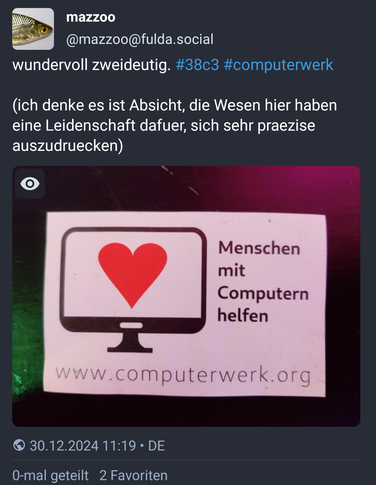

## Folien online

[ses-ch.github.io/Schnupperkurs](https://ses-ch.github.io/Schnupperkurs/)

Quellcode: [github.com/SES-CH/Schnupperkurs](https://github.com/SES-CH/Schnupperkurs)

## Basierend auf

«38c3 Esperanto course»

von

Eva Fitzelová 🇸🇰 · Johannes Mueller 🇩🇪

[github.com/c3esperanto/kurseto](https://github.com/c3esperanto/kurseto)

# Einleitung

## Quick facts

* veröffentlicht 1887 durch L. L. Zamenhof,  
  Polen (damals Teil des russischen Zarenreichs)
* Anzahl Nutzende:  
  $10^3$ Muttersprachler:innen, $10^5$ fließend, $10^6$ «angefangen zu lernen»
* language code: *eo*, *epo*
  * viel localized Software: WordPress, Hunspell, …

### Sprach-Eigenschaften

* phonetisches Alphabet
* ⅔ der Wortstämme romanisch, ⅓ germanisch (dazu slawisch, altgriechisch, hebräisch)
* simple Grammatik
* Wort·bau·system

## Beispieltext

Mi iris al Hamburgo antaŭ tri semajnoj por partopreni la Ĥaos-Komunikadan Kongreson. Estis mia 8a tia kongreso kaj mi ege ĝuis ĝin. Esperantistoj eĉ havis siajn propran asembleon kun interesa LED-instalaĵo.

Nun mi estas en Berno por prelegi iome pri Esperanto.

# Alphabet und Aussprache

## Aussprache-Regeln

* bijektive Abbildung zwischen Schreibweise und Aussprache
* Betonung auf der zweitletzten Silbe
* genau eine Silbe pro Vokal
* keine langen oder kurzen Vokale

## Das Alphabet

Basierend auf dem lateinischen Alphabet, **aber**

* kein "w" – nur "v" (Vindozo)
* kein "x" – stattdessen "ks" (Linukso)
* kein "y" – nur "i"
* "c" wie deutsches "z"
* "z" wie englisches "z" (stimmhaft)

---

Esperanto-spezifische Buchstaben

* ŝ – wie "sch" in "**sch**ön"
* ĉ – wie "tsch" in "**Tsch**echien"
* ĝ – wie "Dsch" in "**Dsch**ungel" (stimmhaft)
* ĵ – wie "J" in "**J**ounalist"
* ĥ – wie "ch" in "Ba**ch**"
* ŭ – wie "u" (Halbvokal)

Die Buchstaben "j" und "ŭ" sind sogenannte "Halbvokale".
Sie werden fast wie die Vokale "i" und "u" ausgesprochen,
bilden aber keine eigenen Silben, sondern Diphthonge.

# Grundlagen der Grammatik

## Personalpronomen

+---+-----+-------+
|   | $1$ | $> 1$ |
+===+:===:+:=====:+
|1. | mi  | ni    |
+---+-----+-------+
|2. |    vi       |
+---+-----+-------+
|   | ♂ li|       |
|   +-----+       |
|3. | ♀ ŝi| ili   |
|   +-----+       |
|   | ☐ ĝi|       |
|   +-----+       |
|   | ⚧ ri|       |
+---+-----+-------+
|?  |    oni      |
+---+-------------+

## Verben

Verb-Endungen

* Infinitiv: *-i* (esti, nomiĝi, plaĉi)
* Gegenwart: *-as* (estas, nomiĝas, plaĉas)
* Vergangenheit: *-is* (estis, nomiĝis, plaĉis)
* Zukunft: *-os* (estos, nomiĝos, plaĉos)
* konditional / irreal: *-us* (estus, nomiĝus, plaĉus)
* Wunsch / Befehl: *-u* (estu, nomiĝu, plaĉu)

vidi, aŭdi, ami, manĝi, trinki, drinki, …

Mi amas vin. – Ni trinkas ĉunkon. – Ili manĝas picon.

## Nomen

* *-o* (kongreso, kurso, lingvo, tablo, seĝo, fenestro, pomo, …)
* plural: *-j* (kongresoj, kursoj, lingvoj, tabloj, seĝoj, fenestroj, pomoj, …)

## Adjektive

* *-a* (bela, granda, ruĝa, verda, kongresa, dolĉa, plaĉa)
* plural: *-j* (belaj, grandaj, ruĝaj, verdaj, kongresaj, dolĉaj, plaĉaj)

Hamburgo estas granda urbo. – Hamburgo estas bela.

## abgeleitete Adverbien

* *-e* (bele, grande, ruĝe, verde, kongrese, dolĉe, plaĉe)

La kanto estas bel*a* kaj ŝi bel*e* kantis ĝin.

## Ja/Nein-Fragen

* **Ĉu** vi ŝatas la kongreson?
* *Jes*, mi ŝatas la kongreson. / *Ne*, mi ne ŝatas la kongreson.

## Akkusativ

*-n*

Markiert das direkte Objekt. Beispiele:

* Mi amas vi*n*
* Ĉu vi ŝatas la kongreso*n*?
* Ŝi manĝas dolĉaj*n* pomoj*n*.

Hat noch weitere Verwendungen, z.B. Ort zu Richtung/Ziel machen:

* Mi dancas en la dancejo. — Ich tanze **im** Tanzklub.
* Mi dancas en la dancejo**n**. — Ich tanze **in den** Tanzklub [hinein].

## Esperanto vermeidet Mehrdeutigkeit

:::::::::::::: {.columns}
::: {.column width="40%"}
{#id .class width=100% height=auto;}
:::
::: {.column width="60%"}
* Homoj *kun* komputiloj helpas.
* Homoj *per* komputiloj helpas.
* Homoj**n** *kun* komputiloj helpi
* Homoj**n** *per* komputiloj helpi
:::
::::::::::::::

## Affixe (Vor- und Nachsilben)

* *-eg-*: granda → grand*eg*a — groß → riesig
* *mal-*: granda → *mal*granda – groß → klein

Hamburgo estas grandega urbo. – Langenthal estas malgranda urbo.

## The power of affixes

|        |         | -in-       | vir-        | -id-       | -ar-       | -ej-       | -ist-       |
|:-------|:--------|:-----------|:------------|:-----------|:-----------|:-----------|:------------|
|        |         | ♀️          | ♂️           | 👶         | {⚫⚫⚫⚫} | 🏠 📍 🛒  | 👷          |
| ŝafo   | 🐑      | ŝaf*in*o   | *vir*ŝafo   | ŝaf*id*o   | ŝaf*ar*o   | ŝaf*ej*o   | ŝaf*ist*o   |
| hundo  | 🐕‍🦺      | hund*in*o  | *vir*hundo  | hund*id*o  | hund*ar*o  | hund*ej*o  | hund*ist*o  |
| bovo   | 🐄      | bov*in*o   | *vir*bovo   | bov*id*o   | bov*ar*o   | bov*ej*o   | bov*ist*o   |
| ĉevalo | 🐎      | ĉeval*in*o | *vir*ĉevalo | ĉeval*id*o | ĉeval*ar*o | ĉeval*ej*o | ĉeval*ist*o |

---

|        |         | -il-       | -ej-       | -ist-        | -ind-       | -em-       | -ul-         |
|:-------|:--------|:-----------|:-----------|:-------------|:------------|:-----------|:-------------|
|        |         | 🪛🛠🔬     | 🏠📍🛒     |👷           | *-enswert*  | *Neigung*  | 🙋           |
| lerni  | *lernen*| lern*il*o  | lern*ej*o  | lern*ist*o   | lern*ind*a  | lern*em*a  | lernem*ul*o  |
| manĝi  | *essen* | manĝ*il*o  | manĝ*ej*o  | manĝ*ist*o   | manĝ*ind*a  | manĝ*em*a  | manĝem*ul*o  |
| muziko | 🎼🎶    | muzik*il*o | muzik*ej*o | muzik*ist*o  | muzik*ind*a | muzik*em*a | muzikem*ul*o |
| naĝi   | 🏊      | naĝ*il*o   | naĝ*ej*o   | naĝ*ist*o    | naĝ*ind*a   | naĝ*em*a   | naĝem*ul*o   |
| haki   | 🪓 / 🧑‍💻 | hak*il*o   | hak*ej*o   | hak*ist*o    | hak*ind*a   | hak*em*a   | hakem*ul*o   |

## Korrelative — tabelvortoj

|     |               | ki-  | ti-  | ĉi-   | i-     | neni-  |
|:----|:--------------|:-----|:-----|:------|:-------|:-------|
|     |               | ❓   | ❗   | 🌐    | ✅🤷   | 🚫     |
| -o  | 📦            | kio  | tio  | ĉio   | io     | nenio  |
| -u  | *welch-* / 🙋 | kiu  | tiu  | ĉiu   | iu     | neniu  |
| -a  | 🟢🟥💛🔷      | kia  | tia  | ĉia   | ia     | nenia  |
| -el | 🐌 / 🏃       | kiel | tiel | ĉiel  | iel    | neniel |
| -e  | 🗺📍          | kie  | tie  | ĉie   | ie     | nenie  |
| -am | 🗓️ 🕰         | kiam | tiam | ĉiam  | iam    | neniam |
| -al | 💣 ⟹ 💥      | kial | tial | ĉial  | ial    | nenial |
| -om | 🔢            | kiom | tiom | ĉiom  | iom    | neniom |
| -es | 🏷            | kies | ties | ĉies  | ies    | nenies |

ĉio – alles · nenie – nirgends · ĉiel – auf jede Weise · iel – irgendwie (auf irgendeine Weise)

## Wichtige "kleine" Wörter

* kaj – ⋀ (`&&`)
* aŭ – ⋁ (`||`)
* la – *bestimmter Artikel*
* al – an / zu / nach / *(Dativ-Objekt)*
* de – von (Zugehörigkeit / Besitz / Herkunft / Sorte)
* ke – dass
* en – in
* el – aus (Herkunft, Material oder Gesamtheit)
* da – von *(Mengenangabe)*
* kun – mit · sen – ohne
* …

## Partizipien

|        | gleichzeitig | zuvor  | danach |
|--------|--------------|-------|--------|
| aktiv  | -ant-        | -int- | -ont-  |
| passiv | -at-         | -it   | -ot-   |

La pas*int*a kongreso okazis en 2023.

La ven*ont*a kongreso okazos en 2025.

La kongreso estas bone organiz*it*a.

# Übung

# Links

## Lernen & Nachschlagen

* [Duolingo](https://www.duolingo.com/course/eo/en)
* [lernu](https://lernu.net)
* [Wikipedia in Esperanto](https://eo.wikipedia.org)
* [Online dictionary (multilingual)](https://reta-vortaro.de)
* [Online dictionary](https://vortaro.net)

## Austausch miteinander

* [Telegram](https://telegramo.org)
* [reddit](https://reddit.com/r/esperanto)
* [StackExchange](https://esperanto.stackexchange.com)
* [Mastodon instance](https://esperanto.masto.host)
* [Amikumu](https://amikumu.com) – App, um mit gleichsprachige in der Nähe zu Chatten
* [Pasporta Servo](https://pasportaservo.org) – Couch Surfing für Esperantist:innen

## Musik

* [Awesome Esperanto music videos](https://www.youtube.com/playlist?list=PLLg4HNcQo8zx3IMEXcrnRCkEhyXWDDf37)
* [Vinilkosmo – Musik-Label](https://www.vinilkosmo-mp3.com/en/)
* [Song-Texte](http://kantaro.ikso.net/)
* [Eternan lumon - Jonny M - Album "Regestilo"](https://www.youtube.com/watch?v=8J9jz9VpUsI)
* [Samideano - ETERNE RIMA (Tokio/Tokyo)](https://www.youtube.com/watch?v=PrHU_lICydA)
* [Abatejo – Amon mi bezonas](https://www.youtube.com/watch?v=dA-WdEcMacw)
* [Martin kaj la talpoj - Gefratoj](https://www.youtube.com/watch?v=EeXMv_94A_U)
* [i.d.c. - La fina venk'](https://www.youtube.com/watch?v=qJUYODkEr-o)
* [i.d.c. - Tatua papili'](https://www.youtube.com/watch?v=CXMbOKc93wY)
* [i.d.c. - Berlino sen vi](https://www.youtube.com/watch?v=530Y4a6jomI)
* [i.d.c. – La nokta stirado](https://www.youtube.com/watch?v=DNjsx8xjdC0)
* [LPG - La Kosma Aventuro](https://www.youtube.com/watch?v=fGPlcWsfZgs)
* [Supernova - La postrompiĝa temp'](https://www.youtube.com/watch?v=PWeqykF7A_U)
* [Gijom - La postrompiĝa temp'](https://www.youtube.com/watch?v=-XiqpAjPd8A)
* [Gijom - Kortuŝa Eksces'](https://www.youtube.com/watch?v=WencRDLDJVY)

## Videos, Podcasts usw.

* [Studio](http://novajhoj.weebly.com/)
* [kern.punkto](https://kern.punkto.info) – Podcast von Eva und Johannes
* [Esperanto natives](https://www.youtube.com/watch?v=UzDS2WyemBI)
* [TEJO Esperanto](https://www.youtube.com/channel/UC1cW8y4NncmbRr6zD5IO8xw/videos)

## Kongresse, Treffen (Auswahl)

* [Esperanto-Weltkongress](https://de.wikipedia.org/wiki/Esperanto-Weltkongress)
* [Internationaler Esperanto-Jugendkongress](https://www.wikidata.org/wiki/Q26706)
* [Sommer-Esperanto-Studienwoche](https://ses.ikso.net)
* [Jugend-Esperanto-Woche](https://www.wikidata.org/wiki/Q25847)

mehr: [Eventa Servo](https://eventaservo.org/)

# Kontakt

## Esperanto in Bern

AESB — aktualigita Esperanto-Societo Bern

## Esperanto in der Schweiz

- SES — [Svisa Esperanto-Societo](https://svisa-esperanto-societo.ch/)
- [CDELI](https://www.cdeli.org) — Dokumentations-Zentrum in La Chaux-de-Fonds
- KCE
- Granda Ursino — Privatschule
- diverse lokale Klubs, Vereine, Gesellschaften

---

Koran dankon – Herzlichen Dank!

[github.com/SES-CH/Schnupperkurs](https://github.com/SES-CH/Schnupperkurs)
